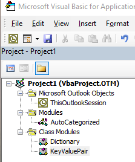
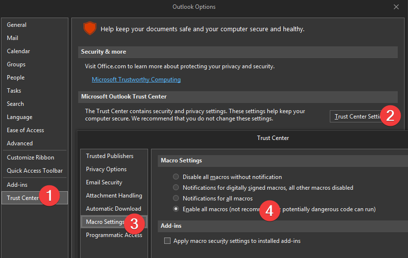

# Automatically Categorise Email on Microsoft Outlook
Automatically add category to incoming email or outgoing email based on 
- Sender,
- Subject, or
- Domain


# Setup Steps:

## Add VBA Project to Outlook
Create different files as showing in the image below



## Enable Macros
You have to enable all macros as shown below




## Modify per your need
Update **Modules/AutoCategorized.vb** file to fit your need
```vb
Public Sub AddSenders()
    Set KnownSenders = New Dictionary
    KnownSenders.Add "Help@domain.com", "Help"
    KnownSenders.Add "do-not-reply@do.not-reply.com", "DNR"
End Sub


Public Sub AddSubjectLines()
    Set KnownSubjectLines = New Dictionary
    KnownSubjectLines.Add "Subject line", "SL"
    
End Sub
   

Public Sub AddDomainNames()
    Set KnownDomains = New Dictionary
    KnownDomains.Add "twitter.com", "Tweet"
    KnownDomains.Add "gmail.com", "Gmail"
    
End Sub
```

## Test it out
In this file, **Modules/AutoCategorized.vb**, you will find the section below. Click inside the Sub and Run (F5) it.
You will notice the categories will be added
**Note:** To see the colors on category, you have to restar the Outlook.

```vb
'' ****************************************
'' - - - - - - - - - - - - - - - - - - - -
''
'' TEST SUBS
''
'' - - - - - - - - - - - - - - - - - - - -
'' ****************************************

Public Sub ApplyCategoriesToAllInboxItems()
    Dim objNS As Outlook.NameSpace: Set objNS = GetNamespace("MAPI")
    Dim olFolder As Outlook.MAPIFolder
    Set olFolder = objNS.GetDefaultFolder(olFolderInbox)
    Dim Item As Object
    
    ' Initialize the list of known doamin dictionary
    AddDomainNames
    
    ' Initialize the list of known subject lines
    AddSubjectLines
    
    ' Initialize the list of the know senders list
    AddSenders
    
    For Each Item In olFolder.Items
        If Item.Class = olMail _
        Or Item.Class = olMeetingReceived Then
        
            OutlookItemReceivedOrSent Item
        End If
    Next
    
    MsgBox "Done"
End Sub
```

## Restart Outlook
Once above two setps are done, restart outlook.
